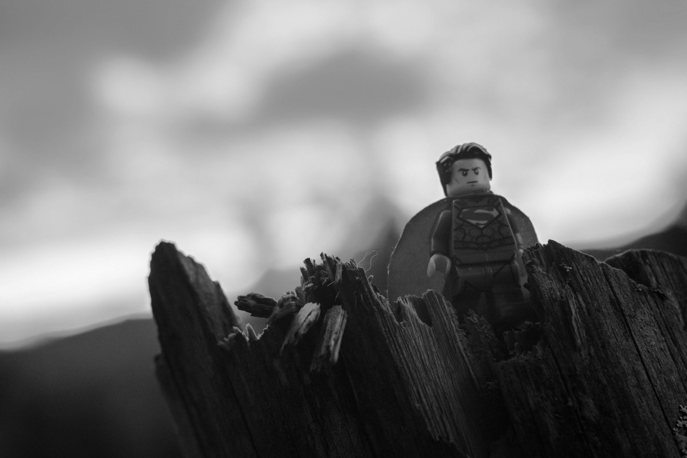

# Cognition sociale et implications locales

## Acteur dans la pénombre, organisation d’évènements, meetups, formations, etc. pourquoi je fais cela ?

5 min read

Depuis notre naissance nous avons tous le besoin universel d’entrer dans un **réseau de relations interhumaines**.

Je ne déroge pas à cette règle de vouloir entrer dans ces réseaux de relations, en étant moi-même organisateur d’évènements, de meetups ainsi que formateur (_mais pas orateur_), mais quelles sont mes motivations ?

# L’envie de s’investir

> Le bénévolat est une action dirigée vers autrui ou vers la communauté avec la volonté de faire le bien, d’avoir une action conforme à de nombreuses valeurs sociétales.

Les motivations de s’investir peuvent être diverses telles qu’avoir la possibilité d’agir pour une cause qui correspond à nos valeurs, transmettre un message clair (_ou bien de manière implicite_), fédérer, regrouper, unifier des individus autour d’une même thématique, une même cause, etc.

L’investissement se fait le plus souvent en offrant de son temps, en partageant son vécu, ses expériences, etc. au sein d’une communauté à laquelle nous-mêmes nous appartenons. Ces investissements, que l’on fait, sont également des moyens pour se sentir accepté par le groupe en question. Nous vivons dans un monde social, où le sentiment que l’on existe passe aussi par l’intermédiaire du regard de l’autre qui nous identifie comme un pair.

## **Besoin d’appartenance**

> L’Homme a besoin de faire partie intégrante de groupes sociaux avec lesquels il partage certaines caractéristiques, ce qui est un moyen à la fois de se reconnaître et d’être reconnu, d’accepter et de se sentir accepté.
>
> [Source](https://www.ithaquecoaching.com)

Lorsque notre besoin d’appartenance sociale est comblé, notre **estime de soi** s’en voit renforcer. Malheureusement, nous vivons dans une société qui pousse à l’**individualisme** et nombreux sont ceux qui ont du mal à combler ce besoin, pouvant provoquer un sentiment de solitude. Et certains d’entre-nous, n’osent pas s’investir.

# Les craintes ?

> Toute conscience de soi n’est en soi et pour soi que quand et parce que, elle est en soi et pour soi pour une autre conscience de soi.
>
> Hegel

Il est important de différencier l’estime de soi de l’approbation (_le regard_) des autres. Généralement, nous accordons plus d’importance au jugement que l’on nous porte, plutôt qu’à l’estime que l’on se porte à soi-même. C’est cette mauvaise estime de soi ou plutôt la projection d’une éventuelle désapprobation de nos pairs qui nous freine dans notre envie de nous investir. Plus particulièrement, la crainte que ce que nous avons à partager au groupe auquel nous appartenons se voit être rejeté.

Bien que les êtres humains aient une attitude sociale, il est possible qu’un groupe rejette un individu pour avoir franchi les “frontières” de ce groupe, frontières qui crées d’autant plus ce sentiment d’appartenance auprès des membres du groupe. En toute logique, si vous appartenez à un groupe et que vous partager des éléments respectant les valeurs du groupe, même si ces éléments se voient erronés ou bien soulevant un débat, le groupe n’aura aucune raison de vous rejeter.

La **peur de l’échec**, la frustration de se tromper est l’une des craintes la plus importante qui nous freine dans notre envie de nous investir. Devoir se mettre au-devant de la scène, face aux membres de son groupe d’appartenance est un exercice qui peut s’avérer compliqué.

La **peur du jugement** est un mécanisme psychologique naturel, mais ce n’est pas le jugement des autres qui nous définit en tant que personne. Nos erreurs ne remettent pas en question le bien-fondé de qui nous sommes, mais nous permettent de progresser et d’avancer.

L’une des contraintes les plus fortes est **le temps.** Nombreux sont ceux souhaitant s’investir dans un groupe ou pour une cause, mais faute de temps, ne peuvent pas. Le temps est un incompressible. Il est important de ne pas s’en vouloir, ne pas se blâmer, chacun fait en fonction de ses possibilités. À mon sens, il ne faut pas exiger de soi-même et des autres un niveau d’implication, mais simplement de respecter ce sur quoi nous nous sommes engagé, sans quoi cela générera de la frustration voir des conflits.

D’autres contraintes existent, organisationnelles, financières, administratives, qui peuvent aussi générer une certaine frustration. Organiser un évènement demande des ressources et dans notre réalité économique actuelle ne pas répondre à une demande, dite, “_mainstream_”, au travers des sujets connexes tout aussi importants, peut soulever diverses barrières. C’est, à mon sens, et dans la mesure du possible, par ce point qu’il faut se laisser le moins contraindre et continuer d’avancer dans des directions qui respectent nos valeurs, ainsi, peut-être, de nouveaux groupes émergeront.

D’après [_Kropotkine_](https://fr.wikipedia.org/wiki/Pierre_Kropotkine), chaque peuple “_primitif_” connu présente une organisation très complexe du clan, ils ont tous un système de reconnaissance à eux. Cela peut également s’appliquer aux différents groupes socio-culturels auxquels nous appartenons.

# Reconnaissance

> Le besoin de reconnaissance se développe en l’être humain tout au long de sa vie

Une nouvelle fois, dès notre naissance nous avons besoin d’être reconnu et tous nous connaissons la [_Pyramide de Maslow_](https://fr.wikipedia.org/wiki/Pyramide_des_besoins) dont le besoin d’estime fait parti.

Nous nous investissons dans un groupe, pour une cause, avec diverses motivations, qui, pour certains, peuvent être l’extension de son travail, le partage d’une passion, ou tout autres raisons, cependant ce qui est commun c’est ce que nous y gagnons. Nous y gagnons un **enrichissement** à la fois personnel, culturel et relationnel.

Nous y rencontrons des personnes qui deviendrons des amis, de futurs collaborateurs, nous apprenons à leur contact et au travers différents échanges.

Enrichissement qui, par moments, produit en nous ce sentiment de reconnaissance, quelques peut grisant. Pouvant-être imagé par la sensation de se sentir tel un super héros, ce n’est pas une question d’orgueil, d’égoïsme ou d’immaturité mais bien ce sentiment de reconnaissance que l’on ressent.

Une des caractéristiques première de la reconnaissance, et ce quelle que soient sa forme, est que la demande étant par nature inépuisable, sa satisfaction ne peut jamais être complète ou définitive.

# Transformons notre milieu

Dans les groupes auxquels vous appartenez, ou auxquels vous souhaitez appartenir, il est important de faire preuve de tolérance, de tolérance envers les autres mais aussi envers soi-même. En évitant d’entrer dans le cercle vicieux, de se voir uniquement par le prisme de l’image que nous semblons refléter aux autres, laissant ainsi cette unique perspective influencer notre estime de soi.

> Tout être vivant est, dans une très grande mesure le produit du milieu où il vit.
>
> Kropotkine

Dans cette quête perpétuelle de reconnaissance, transformons le milieu dans lequel nous vivons pour devenir ainsi le produit que l’on souhaite.
