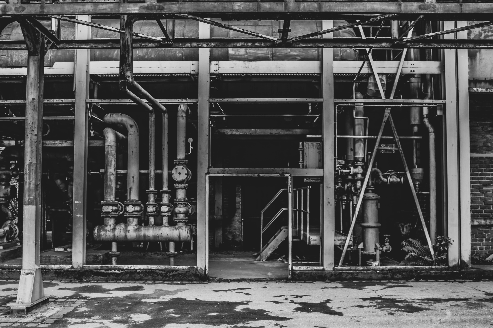

# La place du travail dans ma vie après plusieurs mois de voyage.

## Changement de vision sur la place qu'occupe le travail dans ma vie.

x min read

Étant développeur je suis conscient que mon métier apporte son lot d'avantage (rémunération, conditions de travail, etc.) là n'est pas le sujet, j'ai eu la chance de partir plusieurs mois en voyage en 2019 et ces quelques mois m'ont changer la vision que j'avais de l'occupation du travail dans ma vie.

# Qu’est-ce que le travail ?

Je parle ici du travail dans le sens économique du terme, à savoir : 
> “Une activité économique, profession effectuée contre rémunération, ayant pour but de produire des biens et services.”

Bien que l’étymologie du mot “travail” reste incertaine, l’une des versions provient de l’ancien français, “travail” signifiant souffrance. Depuis le latin populaire tripaliare : “tourmenter avec un tripalium”. Un tripalium étant soit un instrument de torture, soit un instrument qui sert à immobiliser les grands animaux pour les ferrer.

Cette définition étymologique laisse à penser, que le travail représente une forme de souffrance. 

Le travail est une nécessité économique, où nous nous retrouvons à troquer nos compétences, notre temps de vie, contre une rémunération. Il est également, une contrainte sociale, vous avez remarqué que l’une des questions les plus fréquemment posée à une personne que vous ne connaissez pas est de savoir ce qu’elle fait dans la vie, sous entendant quel est son travail.

Le travail occupe une majeure partie de notre vie, c’est via notre travail que l’on prend place dans la société, comme si notre travail est l’unique chose nous définissant.

# Que fais-tu dans la vie ?

Voilà, je pense, la seconde question, après avoir demandé comment se nomme notre interlocuteur, que l’on pose lors d’une conversation avec une personne avec qui nous faisons connaissance.

Cette question, est lourde de sens pour ce qui est de la place du travail dans notre vie. Nous donnons un jugement de valeur à la personne en fonction de sa réponse à cette question, répondre qu’en ce moment vous n’occupez pas de poste particulier est, souvent, perçu comme quelque chose de mauvais.

Comme si, nous nous distinguions __uniquement__ par notre travail au sein de la société, ceci est dû au fait que nous sommes des être sociaux et que nous estimons que le travail est un besoin social, alors qu’il est avant tout une nécessité naturelle, ne pas ou ne plus travailler c’est menacer sa propre survie. Selon Adam Smith, le travail est un besoin naturel __ET__ social, sans travail c'est risquer de perdre tout à la fois, sa vie et sa place dans la communauté. 

